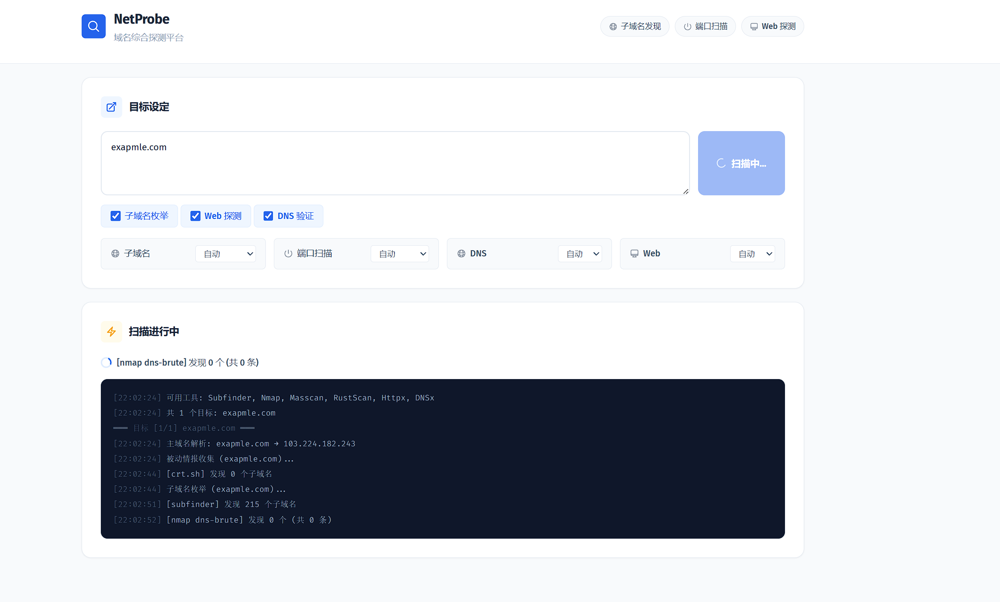
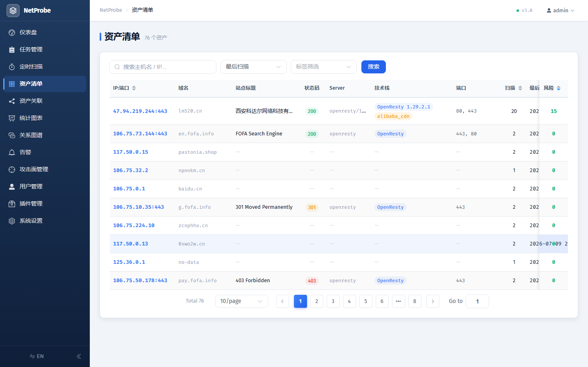

# NetProbe

[](LICENSE)
[](https://www.python.org/)
[](https://fastapi.tiangolo.com/)
[](https://vuejs.org/)
[]()

> 开源一体化资产探测与攻击面管理（ASM）平台

NetProbe 面向红蓝对抗与资产巡检，一条管道打通「子域名发现 → 端口扫描 → Web 探测 → 指纹识别 → 漏洞扫描 → 安全检测 → 风险评分 → 变更检测 → 资产关联 → 多渠道告警」全流程。采用 **FastAPI + Vue 3** 前后端分离架构，内置 **8800+ 条 Web 指纹**（Wappalyzer + FingerprintHub + nuclei tech-detect），支持 **PostgreSQL / SQLite 双后端**，融合中英文情报源，提供 Web UI 与命令行两种使用方式，支持 Docker 一键部署。




## 核心功能

### 一站式扫描管道
- **全流程编排** — 子域名 → 端口 → Web → 指纹 → 漏洞 → 风险评分 → 变更检测 → 资产关联 → 告警，单次任务全覆盖
- **多目标输入** — 支持域名 / IP / CIDR，逗号 / 换行 / 空格分隔，IP 自动反向 DNS
- **扫描引擎可配置** — 6 套预设（快速 / 标准 / 深度 / 仅端口 / 仅 Web / 漏洞专项）+ 用户自定义引擎，按阶段开关与工具选择自由组合
- **实时进度** — SSE 推送每个引擎的运行状态与优雅降级情况，暗色终端风格日志

### 资产识别
- **8800+ 条指纹识别** — 融合 [Wappalyzer](https://github.com/wappalyzer/wappalyzer) + [FingerprintHub](https://github.com/0x727/FingerprintHub) + [nuclei tech-detect](https://github.com/projectdiscovery/nuclei-templates) 三库，覆盖 CMS / 前端框架 / Web 服务器 / CDN / WAF / 统计分析等，HTTP 头部 + HTML 内容 + Cookie 多维匹配，支持版本提取
- **敏感路径探测** — 566 条规则，检测 Git/SVN 泄露、配置文件、备份文件、管理后台、Spring Actuator 等
- **子域名接管检测** — CNAME 悬挂 / 未解析 / 可注册等高危场景识别
- **JS 文件分析** — 从页面 JavaScript 提取 API 端点，检测泄露的密钥/Token（AWS Key、GitHub Token、JWT、Private Key 等）
- **管理后台识别** — title / URL / 正文关键词三重判定，定位后台与登录页
- **WAF/CDN 识别** — 20+ WAF 厂商指纹（Cloudflare / 阿里云 / 腾讯云 / 360 / Imperva 等）+ CDN IP 段库

### 漏洞与安全检测
- **nuclei 漏洞扫描** — 集成 [nuclei v3](https://github.com/projectdiscovery/nuclei)，模板化自动化漏洞检测，结果入库并纳入风险评分
- **CVE 关联** — 指纹识别出版本后，自动查询 OSV/NVD 关联已知 CVE（含 CVSS 评分），优先级排序
- **SSL/TLS 深度检测** — 弱协议版本（SSLv2/v3/TLS1.0/1.1）、弱加密套件（RC4/DES/3DES）、证书过期/自签名/域名不匹配
- **邮件安全基线** — SPF / DKIM / DMARC / MTA-STS / DNSSEC 完整性检测
- **未授权接口枚举** — Swagger / Spring Actuator / phpinfo / .env / Druid / Eureka 等 40+ 路径
- **安全响应头检查** — 检测缺失或弱配置的 HTTP 安全头（CSP / HSTS / X-Frame-Options 等）
- **CORS 配置检测** — 识别宽松跨域（`*` / 反射 Origin / 凭证 + 通配）等缺陷
- **弱口令爆破** — SSH / MySQL / Redis / FTP / PostgreSQL 内置常见口令字典
- **GitHub 代码泄露监控** — 调 GitHub Code Search API 搜索公司名 + 敏感词组合
- **CDN 真实 IP 发现** — crt.sh 证书 SAN + 历史 DNS + 子域名 A 记录 + favicon hash 反查，多源聚合绕过 CDN
- **robots.txt / sitemap 解析** — 提取隐藏路径，反哺敏感路径探测

### 风险评估与变更追踪
- **6 维风险评分** — 敏感路径 / 高危端口暴露 / 脆弱技术栈 CVE / SSL 证书 / 漏洞 / 威胁情报，加权计算 0–100 综合分，自动分级 low/medium/high/critical
- **变更检测 Diff** — 与历史基线做端口 / 指纹 / 敏感路径 / Web 标题 / 证书 / 漏洞多维度 diff，生成变更时间线

### 攻击面管理（ASM）
- **ASM 总览** — 监控目标、扫描趋势、资产总量、告警历史、标签统计一屏聚合
- **域名到期监控** — 解析 WHOIS/RDAP，提前预警即将过期的域名
- **DNS 变更追踪** — 记录 A 记录 / CNAME / NS 变化
- **巡航模式** — 定时扫描 + 告警策略，资产持续监控

### 资产管理
- **资产标签 / 分组** — 自定义标签对资产分组与检索
- **资产关联图谱** — ECharts 6 维度关联图（IP / 证书 / Banner / 指纹 / 标题 / ASN）
- **跨扫描资产汇总** — 唯一 (ip, hostname) 去重聚合，FOFA 风格卡片清单
- **统计与趋势** — 端口分布、技术栈 TopN、漏洞严重度等可视化

### 用户与协作
- **RBAC 细粒度权限** — 4 角色（管理员 / 扫描员 / 审计员 / 只读）× 9 权限（扫描 / 查看 / 编辑 / 删除 / 管理用户 / 管理系统 / 管理插件 / 导出报告 / 漏洞管理），菜单与操作按角色动态过滤
- **JWT 用户认证** — bcrypt 密码哈希，首次启动自动创建默认管理员（admin/admin）
- **用户管理** — 管理员可增删改用户、重置密码、分配角色
- **漏洞生命周期管理** — 7 状态流转（待处理 → 已确认 → 修复中 → 已修复 → 已验证 → 已关闭 + 误报），前端实时更新

### 插件系统
- **可热插拔架构** — 13 个内置检测插件（SSL / CORS / 安全头 / 未授权 / 弱口令 / WAF / 邮件安全 / 管理后台 / robots / 目录爆破 / 接管 / CDN真实IP / CVE关联），按阶段统一调度
- **社区插件** — 将 `.py` 文件放入 `data/plugins/` 即自动注册，继承 Plugin 基类实现 `run()` 方法
- **前端管理** — 插件管理页查看/启用/禁用，按分类分组展示

### 专业报告
- **PDF / HTML 渗透报告** — 封面 + 执行摘要 + 风险矩阵 + 漏洞详情（含 CVE / CVSS / 修复建议）+ 资产清单（端口 / Web / 技术栈），一键导出

### 告警通知
- **6 渠道通知** — Webhook、钉钉、企业微信、飞书、Telegram、邮件（SMTP），高危发现实时推送，所有渠道容错不阻塞扫描

### 引擎与工具
- **多扫描引擎** — nmap / masscan / rustscan 三端口引擎 + subfinder 子域名 + nuclei 漏洞，按可靠性优先级自动调度、优雅降级
- **中英文情报融合** — FOFA / Hunter（中文源）+ crt.sh / Shodan / Censys（国际源）多源聚合
- **定时巡检** — APScheduler 定时任务 + cron 表达式 + 告警策略
- **跨平台** — Windows / macOS / Linux 全平台支持，自动适配工具安装路径

## 快速开始（Docker 部署，推荐）

> 前提：已安装 [Docker](https://docs.docker.com/get-docker/) 与 Docker Compose（Docker Desktop 自带）。

```bash
git clone https://github.com/Evan-lium/NetProbe.git
cd NetProbe

# 一键启动（PostgreSQL + 前端构建 + 安装 nmap/masscan/subfinder/nuclei）
docker compose up -d

# 浏览器访问
#   http://localhost:8000
# 默认账号: admin / admin （首次登录请改密码）
```

容器内已预装 nmap、masscan、subfinder、nuclei、Playwright chromium，开箱即用。

### 数据持久化

`docker-compose.yml` 已配置挂载，**数据库、配置、报告、nuclei 模板**在容器重建后均不丢失：

| 挂载 | 容器路径 | 说明 |
|------|---------|------|
| `./data` | `/app/data` | SQLite 数据库 `netprobe.db` + `settings.json` 配置 + 截图 |
| `./output` | `/app/output` | 扫描报告输出目录 |
| `nuclei-templates`（命名卷）| `/root/nuclei-templates` | nuclei 模板，避免重启重新下载 |

### 环境变量（情报源 API Keys）

API Key 既可在 `data/settings.json` 中配置，也可通过环境变量注入（见 `docker-compose.yml` 的 `environment` 段）。两者二选一：

```yaml
environment:
  TZ: Asia/Shanghai
  FOFA_EMAIL: ""        # FOFA 邮箱
  FOFA_KEY: ""          # FOFA API Key
  HUNTER_KEY: ""        # 奇安信鹰图
  NVD_API_KEY: ""       # NVD 漏洞库（nuclei 漏洞丰富度）
  SHODAN_API_KEY: ""    # Shodan
  GITHUB_TOKEN: ""      # GitHub 代码泄露监控
```

### 启用 SYN 扫描（可选）

nmap 的 SYN 扫描（`-sS`）和 masscan 需要 `CAP_NET_RAW` 权限。如需启用，取消 `docker-compose.yml` 中以下注释：

```yaml
    cap_add:
      - NET_RAW
```

> 默认 TCP connect 扫描无需额外权限即可工作，SYN 扫描更快更隐蔽。

## 手动部署

适用于不使用 Docker、需要本地开发或自定义环境的场景。

### 环境要求

- **Python 3.10+**（推荐 3.12）
- **Node.js 18+**（推荐 20 LTS，用于构建前端）
- **外部扫描工具**（按需安装）：nmap、masscan、subfinder、nuclei

### 1. 后端（FastAPI）

```bash
# 安装 Python 依赖
pip install -r server/requirements.txt

# 开发模式（带热重载，任选其一）
uvicorn server.main:app --host 0.0.0.0 --port 8000 --reload
python -m server.main

# 生产模式
uvicorn server.main:app --host 0.0.0.0 --port 8000 --workers 1
```

后端启动后监听 **8000** 端口，同时托管 `frontend/dist/` 静态文件（同源访问，无需单独起前端服务）。

### 2. 前端（Vue 3 + Vite，仅开发时需要）

```bash
cd frontend
npm install

# 开发模式：vite dev server 监听 5173，自动代理 /api → 8000
npm run dev
# 访问 http://localhost:5173

# 生产构建：产物输出到 frontend/dist/，后端自动托管
npm run build
```

### 3. 安装外部扫描工具

**必选：**

- **Nmap** — [官网下载](https://nmap.org/download.html)
  - Windows：安装时勾选 "Add to PATH"
  - macOS：`brew install nmap`
  - Linux：`sudo apt install nmap` / `sudo yum install nmap`

**推荐（Go 工具，国内加速）：**

```bash
# 安装 Go：https://go.dev/dl/
go env -w GOPROXY=https://goproxy.cn,direct

# subfinder（被动子域名）+ nuclei（漏洞扫描）
go install -v github.com/projectdiscovery/subfinder/v2/cmd/subfinder@latest
go install -v github.com/projectdiscovery/nuclei/v3/cmd/nuclei@latest
```

**可选：**

- **Masscan** — 世界最快端口扫描器，需 root/管理员权限
  - Linux：`sudo apt install masscan`　macOS：`brew install masscan`
- **RustScan** — 快速端口发现 + 自动调用 nmap 服务检测（[Releases](https://github.com/RustScan/RustScan/releases)）

## 使用方式

### Web UI（推荐）

启动后端后访问 **http://localhost:8000**（默认 admin/admin）：

- 多目标输入 + 扫描引擎选择（6 预设 / 自定义）
- 实时进度日志（SSE 推送）
- 结果按目标分组：主机、端口、服务、Web 站点、技术栈、SSL、敏感路径、JS 分析、漏洞、Banner、风险评分、关联图谱
- ASM 总览、资产清单、关联图谱、统计趋势、变更 Diff
- 设置页配置 API Key、通知渠道、扫描引擎、用户管理

### 命令行（CLI）

```bash
# 执行完整扫描
python main.py scan example.com

# 多目标 / IP
python main.py scan example.com baidu.com 8.8.8.8

# 保存结果（txt / csv / json / html）
python main.py scan example.com -f json -o report.json

# 跳过子域名枚举 / Web 探测
python main.py scan example.com --no-dns-brute --no-web

# 自定义子域名字典
python main.py scan example.com -w custom_wordlist.txt

# CI/CD 模式：发现高危时退出码非零
python main.py ci example.com --severity-threshold 70 --fail-on high_risk

# 从 Wappalyzer 拉取并合并最新指纹库
python main.py update-fingerprints
```

常用参数：

| 参数 | 说明 |
|------|------|
| `targets` | 目标域名 / IP / CIDR，空格分隔（必填）|
| `-f, --format` | 输出格式：txt / csv / json / html（默认 txt）|
| `-o, --output` | 输出文件路径 |
| `-w, --wordlist` | 外部子域名字典文件 |
| `--no-dns-brute` | 跳过子域名枚举 |
| `--no-web` | 跳过 Web 站点探测 |
| `--no-validate` | 跳过 DNS 解析验证 |
| `--timeout` | 扫描超时秒数（默认 300）|
| `-v, --verbose` | 显示详细过程 |

## 技术栈

| 类别 | 技术 |
|------|------|
| 后端框架 | FastAPI + Uvicorn |
| 数据库 | SQLite + SQLAlchemy ORM（16 张表）|
| 数据校验 | Pydantic v2 |
| 定时任务 | APScheduler |
| 认证 | JWT（PyJWT）+ bcrypt |
| 浏览器自动化 | Playwright（Web 截图）|
| 前端框架 | Vue 3 + TypeScript |
| UI 组件库 | Element Plus |
| 图表 | ECharts + vue-echarts（关联图谱 / 统计 / 趋势）|
| 状态/路由 | Pinia + Vue Router |
| 国际化 | vue-i18n（中英双语）|
| 构建工具 | Vite |
| 端口扫描 | python-nmap / masscan / rustscan |
| 漏洞扫描 | nuclei v3 |
| 子域名 | subfinder + crt.sh + FOFA + Hunter + nmap dns-brute |
| DNS | dnspython（含系统 DNS fallback）|
| HTTP | requests |
| 规则数据 | JSON（8143 指纹 + 566 敏感路径）|

> 详细的架构设计见 [docs/ARCHITECTURE.md](docs/ARCHITECTURE.md)。

## 法律与免责声明

**请务必阅读以下内容后再使用本工具。**

### 合法使用要求

本工具涉及域名枚举、端口扫描、服务探测等网络行为，在许多国家和地区，未经授权对他人网络系统进行扫描可能构成违法行为。使用前请确保：

1. **已获得明确授权** — 仅对你拥有或已获得所有者书面授权的目标进行扫描
2. **遵守当地法律法规** — 不同国家/地区对网络扫描的法律定义不同
3. **仅用于合法目的** — 自有资产安全审计、授权渗透测试、安全教学与研究、CTF 竞赛

### 禁止用途

严禁将本工具用于：未经授权扫描第三方系统、非法获取他人网络信息或访问权限、任何网络攻击或破坏行为、侵犯他人隐私或商业秘密、其他违反法律法规的行为。

### 免责声明

- 本工具仅供**合法的安全研究和授权测试**使用
- 使用者因不当使用而产生的一切法律责任，由使用者**自行承担**
- 本工具开发者**不承担**任何因使用本工具造成的直接或间接法律责任
- 使用本工具即视为你已阅读、理解并同意以上全部内容

**如果你不确定自己的使用行为是否合法，请不要使用本工具。**

## 致谢

本工具依赖以下优秀的开源项目：

- [Nmap](https://nmap.org/) — 网络发现和安全审计
- [Subfinder](https://github.com/projectdiscovery/subfinder) — 被动子域名枚举
- [Masscan](https://github.com/robertdavidgraham/masscan) — 高速端口扫描
- [RustScan](https://github.com/RustScan/RustScan) — Rust 端口扫描器
- [nuclei](https://github.com/projectdiscovery/nuclei) — 模板化漏洞扫描
- [Wappalyzer](https://github.com/wappalyzer/wappalyzer) — 技术指纹库
- [FingerprintHub](https://github.com/1c3z/fingerprint) — 指纹规则库
- [crt.sh](https://crt.sh/) — 证书透明度日志
- [FOFA](https://fofa.info/) — 网络空间搜索引擎
- [Hunter](https://hunter.qianxin.com/) — 奇安信鹰图平台
- [FastAPI](https://fastapi.tiangolo.com/) — Python Web 框架
- [Vue.js](https://vuejs.org/) — 渐进式前端框架
- [Element Plus](https://element-plus.org/) — Vue 3 UI 组件库
- [ECharts](https://echarts.apache.org/) — 数据可视化图表库
- [dnspython](https://github.com/rthalley/dnspython) — DNS 工具包

## 贡献指南

欢迎贡献！可以通过以下方式参与：

1. **提交 Issue** — 报告 Bug、提出功能建议
2. **提交 Pull Request** — 修复问题或添加新功能
3. **完善规则** — 扩充 Web 指纹 (`netprobe/data/fingerprints.json`)、敏感路径 (`netprobe/data/sensitive_paths.json`)

### 开发指南

```bash
# 克隆项目
git clone https://github.com/lium1128/NetProbe.git
cd NetProbe

# 后端依赖 + 启动（开发，热重载）
pip install -r server/requirements.txt
uvicorn server.main:app --host 0.0.0.0 --port 8000 --reload

# 另开终端：前端 dev server（5173，自动代理 /api → 8000）
cd frontend
npm install
npm run dev
```

## 开源协议

本项目基于 [Apache License 2.0](LICENSE) 开源。

```
Copyright 2024-2026 lium1128

Licensed under the Apache License, Version 2.0 (the "License");
you may not use this file except in compliance with the License.
You may obtain a copy of the License at

    http://www.apache.org/licenses/LICENSE-2.0

Unless required by applicable law or agreed to in writing, software
distributed under the License is distributed on an "AS IS" BASIS,
WITHOUT WARRANTIES OR CONDITIONS OF ANY KIND, either express or implied.
See the License for the specific language governing permissions and
limitations under the License.
```
